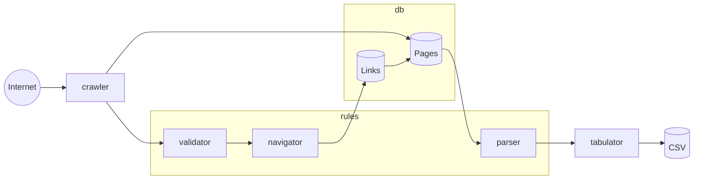

# Crab

Parser-toolkit for fast and furious crawling and parsing sites on the Internet. The main goal is to provide tools for implementing independent crawling and parsing.

## Why independent crawling matters?

Nearly all parsers are written using try and error approach. If crawling and parsing are done together you are forced to download documents from Internet each time you change a parser. Crab tries to separate crawling logic from parsing logic and maintain localy stored mirror of pages you are parsing.

## Installing

### Mac OS

```console
$ brew install bazhenov/tap/crab
```

### Build from sources
### Prerequirements

* rust toolchain
* python 3
* sqlite3

```console
$ git clone https://github.com/bazhenov/crab
$ cd crab
$ cargo install --path=.
```

## Gettings started

### Creating Workspace

Let's write simple parser for brainyquote.com. Start a new project

```console
$ crab new brainyquote
$ cd brainyquote
$ ls
crab.toml
db.sqlite
parser_home_page.py
```

Crab creates main database file as well as skeleton of a python parser.

### Downloading first page

Now let's register our first page in the database

```console
$ crab register https://www.brainyquote.com/ 1
```

Here we provide URL and a page type. Each downloaded and parsed page has it's own type id. Different page types are processed by different parsers. It allows to separate navigating and parsing logic of complex sites.

Now let's download first page using following command

```console
$ crab run-crawler
```

This command will download all not already downloaded pages in the database. In our case we have only one page. We can confirm it's downloaded using following command

```console
$ crab list-pages
     id  type_id  depth  status           url
------------------------------------------------------------------------------------------------------------------------
      1        1      0  downloaded       https://www.brainyquote.com/
```

This command allows to inspect state of all the pages in the database. We also can get the content of a page

```console
$ crab dump 1

<!DOCTYPE html>
<html lang="en">
<head>
<title>Inspirational Quotes at BrainyQuote</title>
<meta name="robots" content="all">
<meta charset="utf-8" />
<meta name="viewport" content="width=device-width, initial-scale=1.0, viewport-fit=cover"><meta name="description" content="Share our collection of inspirational and famous quotes by authors you know and love. Share our Quotes of the Day on the web, Facebook, Twitter, and blogs.">
<meta name="googlebot" content="NOODP">
<meta property="ver" content="13.3.11:5238611">
...
```

### Writing parser

At this stage we have download one page, but crab has no information how to navigate between pages. Let's write simple rule how to navigate to the quotes page of a particular author.

Open `parser_home_page.py` and write following `navigate()` function:

```python
from bs4 import BeautifulSoup

def navigate(content: str) -> list[(str, int)]:
    html = BeautifulSoup(content, 'html.parser')
    links = []
    for a in html.select(".homeAuthorsExploreBlock a"):
        if a['href'] and '/authors/' in a['href']:
            links.append((a['href'], 2))
    return links
```

Here we're using [BeautifulSoup](https://www.crummy.com/software/BeautifulSoup/bs4/doc/) as a HTMLparsing toolkit. It's a simple rule that retrive all the links in an element with css class `homeAuthorsExploreBlock`. It checks if URL contains `/authors/` and return URL to crab as a next page for parsing.

Note that each url is tagged with number `2`. This is page type for a target page.

We can now check if out rules are works correctly:

```console
$ crab navigate 1
  2  https://www.brainyquote.com/authors/a-p-j-abdul-kalam-quotes
  2  https://www.brainyquote.com/authors/alan-watts-quotes
  2  https://www.brainyquote.com/authors/albert-camus-quotes
  2  https://www.brainyquote.com/authors/alexander-the-great-quotes
  2  https://www.brainyquote.com/authors/amelia-earhart-quotes
  2  https://www.brainyquote.com/authors/anne-frank-quotes
  2  https://www.brainyquote.com/authors/arthur-schopenhauer-quotes
  2  https://www.brainyquote.com/authors/benjamin-franklin-quotes
  2  https://www.brainyquote.com/authors/bertrand-russell-quotes
  2  https://www.brainyquote.com/authors/bill-gates-quotes
  [...]
```

This command output all outging links found on a page #1 as well as theirs page type IDs. In our case we tell crab that page type for all those pages is 2. Which means that crab will be using different parser for parsing and navigating those pages.

Now let's write all this outgoing links to the database:

```console
$ crab navigate-all
```

This command traverse all downloaded pages, apply navigation rules and writes discovered pages back to the database. After that we need to run crawler to downloaded them

```console
$ crab run-crawler
```

Now let's check for a page with Alan Watts quotes:

```console
$ crab list-pages | grep -i watts
      3        2      0  downloaded       https://www.brainyquote.com/authors/alan-watts-quotes

```

So it's page #3 with page type id 2. Let's create new parser for those type of pages. Let's create file `parser_author.py` with followinf content:

```python
from bs4 import BeautifulSoup
TYPE_ID: int = 2

def parse(content: str) -> dict[str, list[dict[str, str]]]:
    html = BeautifulSoup(content, 'html.parser')
    
    title = html.select_one("nav h1")
    author = title.text.strip() if title else ''

    quotes = html.select('#quotesList a div')
    quotes = [{'author': author, 'quote': q.text.strip()} for q in quotes]
    return {'quotes': quotes}
```

All parser filenames must start with `parser_` prefix and contains `TYPE_ID` constant indicating for which pages this parser is suposed for.

Now let's run parser logic on a page

```console
$ crab parse 3
quotes
------------------------
- author: Alan Watts Quotes
  quote: The only way to make sense out of change is to plunge into it, move with it, and join the dance.
- author: Alan Watts Quotes
  quote: To have faith is to trust yourself to the water. When you swim you don't grab hold of the water, because if you do you will sink and drown. Instead you relax, and float.
- author: Alan Watts Quotes
  quote: I have realized that the past and future are real illusions, that they exist in the present, which is what there is and all there is.
- author: Alan Watts Quotes
  quote: No work or love will flourish out of guilt, fear, or hollowness of heart, just as no valid plans for the future can be made by those who have no capacity for living now.
```

### Exporting as a CSV

```console
$ crab export-table quotes
```

Exports all the quotes in a CSV format

### Running parser in a wild

So when you are write all the logic for navigating pages you need basically do following steps:

1. `crab navigate-all` - will run naviagtion rules on all the pages and discover new links
2. `crab run-crawler --navigate` to downloaded all the pages. Crawler will not apply navigation rules to freshly downloaded pages, by default. So no new pages will be discovered. But if you pass `--navigate` downloading and discovering will run simultaneiously.

## Architecture

